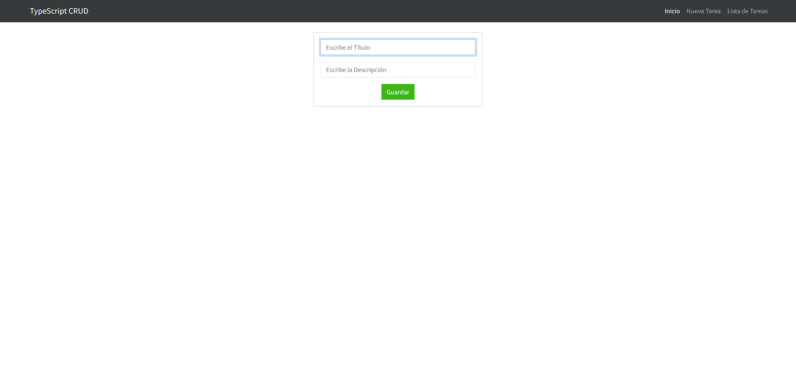

# Aplicación CRUD con TypeScript, MongoDB, Node.js, Express y Handlebars

Este proyecto es una aplicación CRUD desarrollada utilizando TypeScript como lenguaje de programación, MongoDB como base de datos NoSQL, Node.js como entorno de ejecución del lado del servidor, Express como framework web y Handlebars como motor de plantillas.

## Características

- **Crear (Create):** Permite agregar nuevos registros a la base de datos.
- **Leer (Read):** Recupera información de la base de datos y la muestra al usuario.
- **Actualizar (Update):** Permite modificar registros existentes en la base de datos.
- **Eliminar (Delete):** Elimina registros de la base de datos.

## Tecnologías Utilizadas

- **TypeScript:** Superset tipado de JavaScript que añade chequeo estático de tipos y programación orientada a objetos.
- **MongoDB:** Base de datos NoSQL que ofrece flexibilidad y escalabilidad.
- **Node.js y Express:** Entorno de ejecución del lado del servidor y framework web que simplifica el desarrollo de aplicaciones web.
- **Handlebars:** Motor de plantillas que permite generar HTML dinámico en el servidor.

## Captura de Pantalla

## Estructura del Proyecto

La aplicación sigue una arquitectura MVC (Modelo-Vista-Controlador), donde Express maneja las rutas y las solicitudes HTTP, y Handlebars se encarga de renderizar las vistas dinámicas.

